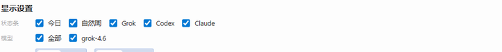

# Hermes Usage Center

Hermes Desktop 的模型用量插件：侧栏整页看板 + 右下角状态条。

本地 Token 按自然日 / 周 / 月聚合。Grok、Codex、Claude 的**官方剩余%**单独成卡。  
**本周期 Token** = 该家官方重置窗口内已用的本地 Token，贴在剩余%旁边，不跟自然周混。


## 你能看到什么

| 位置 | 内容 |
|------|------|
| 侧栏「模型用量」 | 今日 / 本周 / 本月 / 滚动窗口、30 日趋势、本周期表、三家官方额度环 |
| 本周期表 | 每个有官方窗的模型：已用 Token、窗口类型、距重置 |
| 右下角状态条 | `今日` + 各家 `剩余%` + `本周期已用` + 距重置 |
| 悬停某一家 | 只展开这一家：本周期已用、官方额度环、该家今日 / 本周 / 本月 |
| 页底「显示设置」 | 选状态条内容、选模型、单位自动/手动（万/亿 或 K/M/B） |




悬停全额用中文千分位。底栏与表格默认自动单位（万 / 亿）。今日合计、本周期已用、官方剩余% 三套数不互相冒充。

## 安装

需要 Hermes Desktop ≥ 0.20.4。

```bash
hermes plugins install chenleshu/hermes-usage-center
hermes plugins enable usage-center
```

然后在 Desktop：Settings → Plugins 打开 **Hermes Usage Center**（统一包装的桌面半边默认关掉）。  
命令面板搜「模型用量」，或点侧栏入口。改完插件后可用 **Reload desktop plugins**。新后端字段要重挂 gateway 才出真实按家周期数。

一键安装（本机已注册 `hermes://`）：

```
hermes://plugin/install?repo=chenleshu/hermes-usage-center&enable=1
```

社区索引（`Revell-ai/hermes-plugin-index`）已收录短名。若把 `plugins.index_url` 指过去，也可以：

```bash
hermes plugins install usage-center
```

## 口径

- **今日 / 本周 / 本月**：上海时区自然日，按会话开始时间归属。
- **近 7 / 30 / 90 天**：滚动窗口，不是「本月」。
- **本周期 Token**：官方重置窗（周额度 / Session / 5 小时窗）内的本地已用。窗口类型看官方标签，不按「还剩几小时」瞎猜。没有官方窗的模型不进这张表。
- **官方额度**：Codex / Claude 走账户接口；Grok 走本机缓存的周额度快照。过期会标陈旧，不会拿本地 Token 反推会员余量。
- Profile 隔离：每个 Hermes profile 用自己的 `state.db` 和额度缓存。

## 仓库结构

```
plugin.yaml                 # 插件清单
__init__.py                 # 无模型工具，只做注册
dashboard/plugin_api.py     # 聚合 API
dashboard/manifest.json
desktop/plugin.js           # 侧栏页 + 右下角芯片
tests/test_plugin_api.py
```

## 能不能上 Hermes 官方商店

官方索引仓 [NousResearch/hermes-plugin-index](https://github.com/NousResearch/hermes-plugin-index) **还没建**（`index.json` 404，见 [hermes-agent#87565](https://github.com/NousResearch/hermes-agent/issues/87565)）。默认 `hermes plugins search` 因此只能扫到随 CLI 打包的 seed。

现在的路径：

1. 公开仓（立刻能用）：`hermes plugins install chenleshu/hermes-usage-center`
2. 社区索引已合并： [Revell-ai/hermes-plugin-index](https://github.com/Revell-ai/hermes-plugin-index) 的 `usage-center`
3. 官方 seed 待审：[hermes-agent#92043](https://github.com/NousResearch/hermes-agent/pull/92043)
4. GitHub Release：[`v1.11.0`](https://github.com/chenleshu/hermes-usage-center/releases/tag/v1.11.0)
5. Discord `#plugins-skills-and-skins`。核心仓一般不收第三方产品插件。

索引收录只审元数据，**不等于代码审计**。

## 开发

```bash
python -m unittest tests.test_plugin_api
hermes plugins doctor .
```

## 许可

MIT © 2026 Chen Leshu
