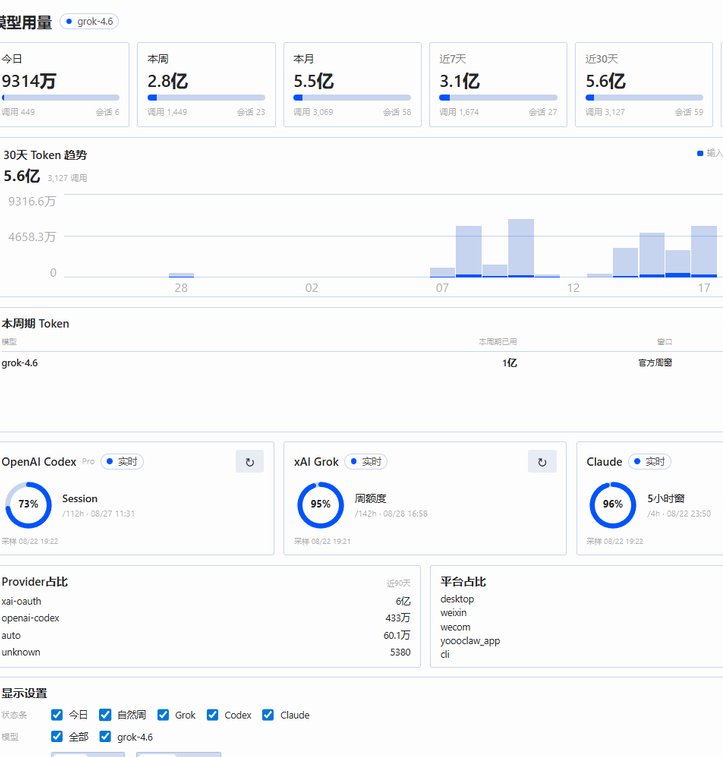
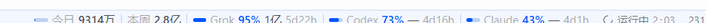
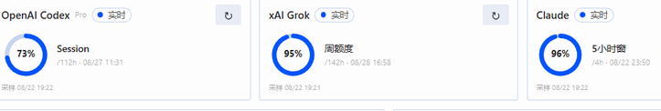

# Hermes Usage Center

Hermes Desktop 的模型用量插件：侧栏整页看板 + 右下角状态条。  
本地 Token 按自然日 / 周 / 月聚合；Grok、Codex、Claude 的官方额度单独成卡，不混口径。



## 你能看到什么

| 位置 | 内容 |
|------|------|
| 侧栏「模型用量」 | 今日 / 本周 / 本月 / 滚动窗口、30 日趋势、三家官方额度环、模型与 Provider 占比 |
| 右下角状态条 | `今日` + `本周` + Grok / Codex / Claude 剩余% |
| 悬停「本周」 | 本周合计 + 全部模型各自的本周 Token |
| 悬停某一家 | 只展开这一家：官方额度环 + 该家今日 / 本周 / 本月 |





数字用中文千分位或「万 / 亿」。状态条悬停看全额；今日合计与订阅余量不会互相冒充。

## 安装

需要 Hermes Desktop ≥ 0.20.4。

```bash
hermes plugins install chenleshu/hermes-usage-center
hermes plugins enable usage-center
```

然后在 Desktop：Settings → Plugins 打开 **Hermes Usage Center**（统一包装的桌面半边默认是关掉的）。  
命令面板搜「模型用量」，或点侧栏入口。改完插件后可用 **Reload desktop plugins**。

一键安装（本机已注册 `hermes://`）：

```
hermes://plugin/install?repo=chenleshu/hermes-usage-center&enable=1
```

## 口径

- **今日 / 本周 / 本月**：上海时区自然日，按会话开始时间归属。
- **近 7 / 30 / 90 天**：滚动窗口，不是「本月」。
- **官方额度**：Codex / Claude 走账户接口；Grok 走本机缓存的周额度快照。过期会标陈旧，不会拿本地 Token 反推会员余量。
- Profile 隔离：每个 Hermes profile 用自己的 `state.db` 和额度缓存。

## 仓库结构

```
plugin.yaml                 # 插件清单
__init__.py                 # 无模型工具，只做注册
dashboard/plugin_api.py     # 聚合 API
dashboard/manifest.json
desktop/plugin.js           # 侧栏页 + 右下角芯片
tests/test_plugin_api.py
```

## 能不能上 Hermes 官方商店

目前没有官方应用商店。大家能装到的路径是：

1. 公开 GitHub 仓 + `hermes plugins install owner/repo`（现在就能用）
2. 向 [NousResearch/hermes-plugin-index](https://github.com/NousResearch/hermes-plugin-index) 提 PR，进 `hermes plugins search`
3. 在 Nous Discord `#plugins-skills-and-skins` 发帖。核心仓一般不收第三方产品插件。

索引收录只审元数据，**不等于代码审计**。

## 开发

```bash
python -m unittest tests.test_plugin_api
hermes plugins doctor .
```

## 许可

MIT © 2026 Chen Leshu
